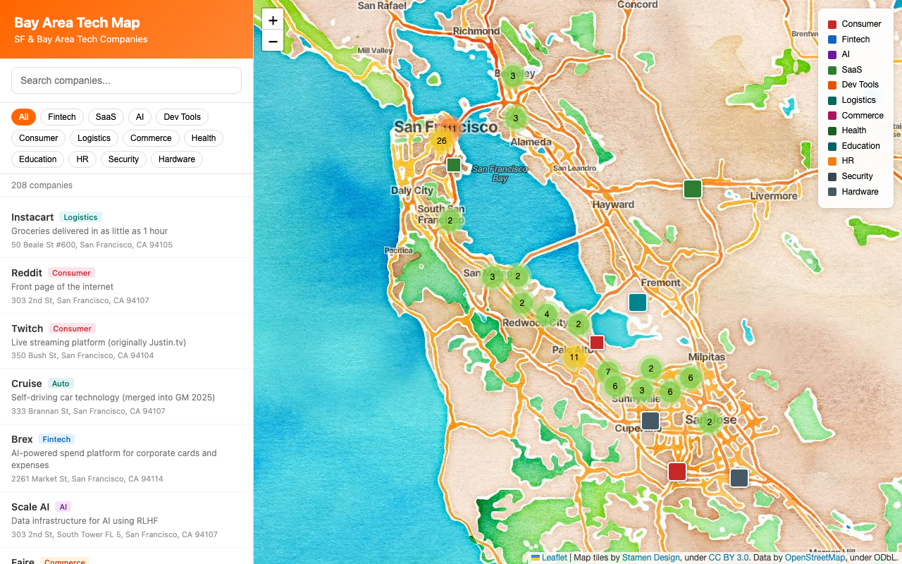

# Bay Area Tech Map

一张交互式地图，收录了旧金山湾区 200+ 家科技公司，使用 Leaflet.js 和 Stamen 水彩风格地图瓦片构建。

**[查看在线地图](https://your-username.github.io/bay-area-tech-map/)** <!-- 部署 GitHub Pages 后替换为实际 URL -->



> *其他语言: [English](README.md) | [日本語](README_ja.md)*

## 特性

- **208 家已验证公司** — 从 YC 初创到 FAANG 大厂，所有地址均为真实办公地点
- **水彩风格地图** — 使用 Stamen 瓦片的手绘美学风格
- **公司 Logo** — 知名公司以 Logo 作为地图标记
- **搜索与筛选** — 按名称、描述或类别查找公司
- **16 个分类** — AI、金融科技、SaaS、消费者、开发工具、硬件等
- **标记聚合** — 密集区域（如 SoMa）也能保持清爽

## 快速开始

```bash
# 克隆仓库
git clone https://github.com/your-username/bay-area-tech-map.git
cd bay-area-tech-map

# 本地启动（任何静态服务器都行）
npx serve .
# 或者
python3 -m http.server 3000
```

然后打开 [http://localhost:3000](http://localhost:3000)。

## 贡献

想添加公司？详见 [CONTRIBUTING.md](CONTRIBUTING.md)。

**两种贡献方式：**
1. 编辑 `companies.json` 并提交 PR
2. [提交 Issue](../../issues/new?template=add-company.yml) 填写公司信息

所有地址均需验证 — 不接受虚拟信箱或注册代理地址。

## 许可证

[MIT](LICENSE)
